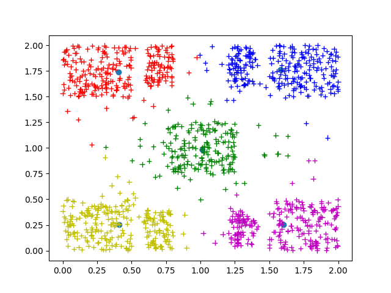
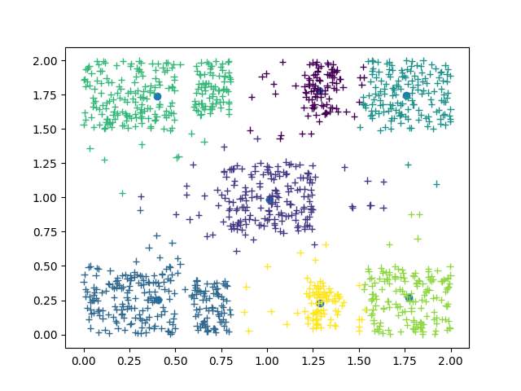
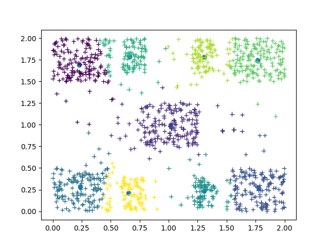
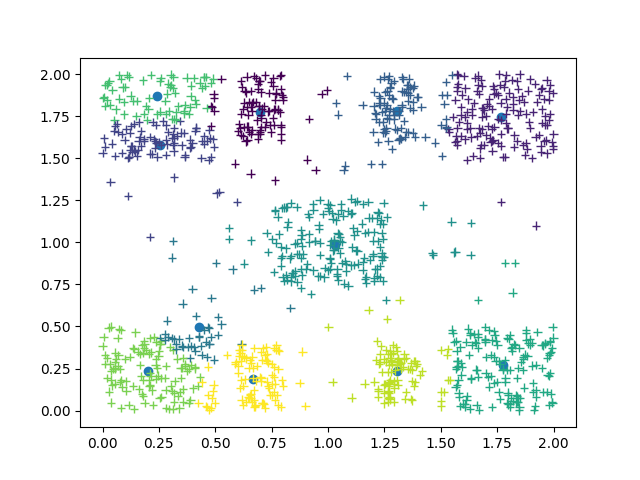
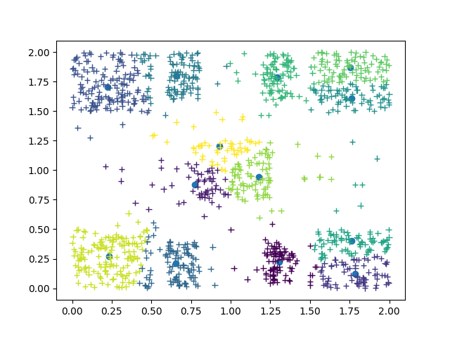
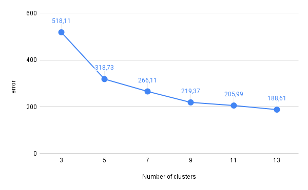

# **Εργαστηριακές Ασκήσεις στην Υπολογιστική Νοημοσύνη ακ. έτους 2021-2022**

Πούλος Βασίλης, 2805\
Δημητρόπουλος Δημήτρης, 4352\
Πούλος Γρηγόρης, 4480

## **Δημιουργία Συνόλων Δεδομένων**

Για την δημιουργία των συνόλων δεδομένων έχει δημιουργηθεί το αρχείο
`generate_dataset.c` το οποίο με την εκτέλεση του δημιουργεί τα `training_set.txt`
και `test_set.txt` για την εκπαίδευση και τον έλεγχο του νευρωνικoύ δικτύου της
πρώτης άσκησης και το `dataset2.txt` για τον αλγόριθμο kmeans της δεύτερης άσκησης.

Παράδειγμα εκτέλεσης:

```bash
$gcc generate_dataset.c utility.c -lm
$./a.out 

```

## **Plotting**

Για την γραφική αναπαράσταση των δεδομένων χρησιμοποιείται το `plot_dataset.py`
το οποίο δέχεται 1 ή 2 αρχεία της μορφής `<x>, <y>, <label>`. Στην περίπτωση που
εισάγουμε ένα αρχείο το script εμφανίζει το σύνολο δεδομένων με χρώματα ομάδων
ανάλογα του `<label>`. Το προαιρετικό δεύτερο όρισμα υποθέτει οτι ο χρήσης
δίνει ως είσοδο κέντρα του kmeans στην μορφή `<x>, <y>, <cluster_id>` τα
οποία εμφανίζονται κάτω απο τα προηγούμενα δεδομένα με την μορφή ενός κύκλου.

Παραδείγματα εκτέλεσης:

```bash
$python plot_dataset.py ../../data/training_set.txt 
```


```bash
$python plot_dataset.py ../../out/labeled_data.txt ../../out/kmeans_clusters.txt  
```


## **Σχόλια Υλοποίησης**

Η αρχική υλοποίηση της εργαστηριακής άσκησης ήταν εξ'ολοκλήρου σε C. Λόγω
κάποιου προβλήματος στον σχεδιασμό του MLP στην πρώτη άσκηση η τελική υλοποίηση
του παραδίδεται σε Java. Η αποσφαλμάτωση του κώδικα σε C κόστιζε περισσότερο
χρόνο απο ότι μπορούσαμε να διαθέσουμε επομένως η υπάρχουσα λογική μεταφράστηκε
σε Java.

Τα περιεχόμενα καθε φακέλου στο παραδοτέο εξηγούνται παρακατω:

+ `data`: τα απαραίτητα σύνολα δεδομένων για την εκτέλεση των προγραμμάτων.
+ `out`: αρχεία εξοδου των προγραμμάτων και επιλεγμένες έξοδοι απο τις εκτελέσεις
με την καλύτερη απόδοση.
+ `src/mlp`: η υλοποίηση του mlp σε Java.
+ `src/kmeans`: η υλοποίηση του kmeans σε C. Σε αυτό τον φάκελο περιέχεται και
το πρόγραμμα `generate_dataset.c` όπως αναφέρθηκε παραπάνω καθώς εξαρτάται απο
το αρχείο `utility.c` στο οποίο είναι συγκεντρωμένες διάφορες βοηθητικές
συναρτήσεις.

## **Άσκηση 1**

### **Παράμετροι και Εκτέλεση**

Στην άσκηση αυτή υλοποιήθηκε το MLP Νευρωνικό Δίκτυο το οποίο μπορεί να
παραμετροποιηθεί και να εκτελεστεί με αρχείο `runMlp.java`.

+ Η παραμετροποίηση πραγματοποιείται δίνοντας τιμές στις μεταβλητές στο αρχείο
όπως φαίνεται παρακάτω:

```java
int numOfHiddenLayers = 3; // type "2" or "3"
int D = 2;
int H1 = 10;
int H2 = 8;
int H3 = 8; // Ignored if numOfHiddenLayers == 2
int K = 4;
String hiddenLayerActivationFunction = "tanh"; //type "relu" or "tanh"
double LEARNING_RATE = 0.0009;
int BATCH_SIZE = 1;
int MINIMUM_EPOCHS = 700;
double TERMINATION_THRESHOLD = 0.1;
```

+ Για την εκτέλεση:
  
```bash
$javac Neuron.java Mlp.java runMlp.java
$java runMlp 
```

Κατά την εκτέλεση του προγράμματος καλούνται τρεις βασικές συναρτήσεις:

```java
mlp.initWeights();
mlp.gradientDescent("../../data/training_set.txt");
mlp.testNetwork("../../data/test_set.txt");
```

+ Με την `initWeights()` αρχικοποιούνται όλα τα βάρη και οι πολώσεις του δικτύου
σε τυχαίους αριθμούς μεταξύ -1 και 1.
+ Με την `gradientDescent()` φορτώνεται το αρχείο που περιέχει τα δεδομένα εκπαίδευσης
του δικτύου και τρέχει ο αλγόριθμος για τις παραμέτρους που έχουν οριστεί. Για την
λειτουργία του αλγορίθμου έχουν υλοποιηθεί οι συναρτήσεις `forwardPass(double[] networkInput)`,
που δέχεται ως όρισμα μια είσοδο για το δίκτυο και επιστρέφει την έξοδο του και η
`backprop(double[] networkInput, double[] data_label)` η οποία δέχεται ως όρισμα μια είσοδο
και την επιθυμητή κατηγορία που θα πρέπει να επιστρέψει το δίκτυο, υπολογίζει το σφάλμα και
την μερική παράγωγο σε κάθε νευρώνα. Ανάλογα με τον αριθμό τον mini-batches που έχουμε δώσει
καλείται η συνάρτηση `updateWeights()` η οποία ενημερώνει τα βάρη και τις πολώσεις στο δίκτυο
χρησιμοποιώντας τον ρυθμό μάθησης που έχει οριστεί. Η εκπαίδευση τρέχει για το ελάχιστο των 700
εποχών (`MINIMUM_EPOCHS`) όπως ορίζεται και συνεχίζει να τρέχει μέχρι η διαφορά δύο διαδοχικών
σφαλμάτων να είναι μικρότερη απο το κατώφλι που ορίζεται στην αρχή του προγράμματος
(`TERMINATION_THRESHOLD`). Καθ' όλη την διάρκεια της εκτέλεσης τυπώνεται το συνολικό σφάλμα
εκπαίδευσης σε κάθε εποχή και κατά τον τερματισμό γράφονται όλα τα αποτελέσματα στο αρχείo
`mlp_output.txt`. Τέλος τυπώνεται ο χρόνος που χρειάστηκε για την ολοκλήρωση της εκπαίδευσης.
+ Με την `testNetwork()` φορτώνονται τα δεδομένα ελέγχου του δικτύου και ύστερα δίνονται ως είσοδο
συγκρίνοντας την έξοδο του με την επιθυμητή. Στο τέλος της εκτέλεσης της τυπώνεται το ποσοστό
των σωστών αποφάσεων στο σύνολο ελέγχου και γράφονται στο αρχείο `mlp_error.txt` τα παραδείγματα
ελέγχου με το σύμβολο "+" εάν το δίκτυο επέλεξε την σωστή κατηγορία για το συγκεκριμένο παράδειγμα
και "-" σε αντίθετη περίπτωση.

### **Συνάρτηση Εξόδου**

Για την συνάρτηση εξόδου του δικτύου χρησιμοποιείται η λογιστική συνάρτηση (sigmoid)
καθώς αυτή χρησιμοποιείται για την ταξινόμηση δεδομένων σε κατηγορίες.  

### **Βέλτιστο Δίκτυο που Παρατηρήθηκε**

Παρακάτω δίνονται οι παράμετροι που χρησιμοποιήθηκαν για το δίκτυο με το
μικρότερο σφάλμα γενίκευσης:

```java
int numOfHiddenLayers = 3; // type "2" or "3"
int D = 2;
int H1 = 10;
int H2 = 10;
int H3 = 8; // Ignored if numOfHiddenLayers == 2
int K = 4;
String hiddenLayerActivationFunction = "tanh"; //type "relu" or "tanh"
double LEARNING_RATE = 0.003;
int BATCH_SIZE = 1;
int MINIMUM_EPOCHS = 700;
double TERMINATION_THRESHOLD = 0.01;
```


Τα αρχεία εξόδου της παραπάνω εκτέλεσης είναι αποθηκευμένα στον φάκελο `out` με
ονόματα `mlp_error_final.txt` και `mlp_output_final.txt`.

### **Παρατηρήσεις**

<ins>Μεταβολή αριθμού νευρώνων στα κρυμμένα επίπεδα</ins>

Μεταβάλλοντας τον αριθμό των νευρώνων σε δίκτυο με δύο κρυμμένα επίπεδα
παρατηρήθηκε πως η αύξηση στο πρώτο επίπεδο έχει μεγαλύτερη επίδραση στην
γενικευτική ικανότητα σε σύγκριση με την αύξηση στο δεύτερο κρυμμένο επίπεδο.
Ομοίως, σε δίκτυο με τρία κρυμμένα επίπεδα, παρατηρούνται όλο και μικρότερες
μεταβολές κατα την μεταβολή του πλήθος των νευρώνων από το πρώτο στο τρίτο
κρυμμένο επίπεδο.
Ακόμα να σημειωθεί πως με την προσθήκη του τρίτου κρυμμένου επιπέδου δεν
παρατηρήθηκε σημαντικό όφελος καθώς αυξανόταν ο χρόνος εκπαίδευσης και
χωρίς να υπάρχει σημαντική αύξηση στην γενικευτική ικανότητα.

<ins>Συνάρτηση ενεργοποίησης</ins>

Χρησιμοποιώντας τις δύο συναρτήσεις ενεργοποίησης παρατηρήθηκε πως με την χρήση της relu
μειώνεται ο χρόνος εκπαίδευσης του δικτύου μειώνοντας όμως την ικανότητα γενίκευσης.
Ακόμα παρατηρήθηκαν περιπτώσεις κατα τις οποίες πολλοί νευρώνες "νεκρώνονται",
δηλαδή έχουν συνεχόμενα έξοδο μηδέν με αποτέλεσμα να εμποδίζουν την εκπαίδευση
του δικτύου και μειώνουν την γενικευτική ικανότητα.
Χρησιμοποιώντας την υπερβολική εφαπτομένη ο χρόνος εκπαίδευσης αυξάνεται αρκετά
επιτυγχάνοντας όμως υψηλότερη ικανότητα γενίκευσης και αποφεύγοντας το πρόβλημα
που αναφέρθηκε παραπάνω.

<ins>Μέγεθος mini-Batch</ins>

Η αύξηση του μεγέθους mini-batch συμβάλλει στην μείωση του χρόνου εκπαίδευσης
μειώνοντας ωστόσο την γενικευτική ικανότητα του δικτύου.

## **Άσκηση 2**

### How to run

Για να εκτελεστεί ο kmeans και να εμφανιστούν τα
αποτελέσματα (plot) χρησιμοποιείται το bash script
`plot_kmeans.sh`
ως:

```bash
$bash plot_kmeans.s
```

To script θα κάνει compile τα απαραίτητα αρχεία για
την παραγωγή του εκτελέσιμου, θα εκτελέσει τον kmeans 20 φορές με τυχαία
επιλεγμένα αρχικά κέντρα, θα κρατήσει την λύση με το μικρότερο σφάλμα
ομαδοποίησης και στην συνέχεια θα καλέσει το `plot_dataset.py` για να
εμφανίσει το αποτέλεσμα.

Η παραπάνω εκτέλεση χρησιμοποιεί τη μεταβλητή `NUM_OF_CLUSTERS` που
ορίζει το επιθυμητο αριθμό κέντρων, η οποία έχει οριστεί με define στο
αρχείο `kmeans.h` και μπορεί να αλλαχθεί σε οποιονδήποτε αριθμό.

Με τον παραπάνω τρόπο εκτελείται ο kmeans για Μ = 3, 5, 7, 9, 11, 13 κέντρα
και επιστρέφονται τα παρακάτω αποτελέσματα.

|                                          |                                          |
| :--------------------------------------: | :--------------------------------------: |
|   M = 3   |   M = 5   |
|   M = 7   |   M = 9   |
|  M = 11 |  M = 13 |

Το καλύτερο σφάλμα ανα περίπτωση τυπώνεται στο τερματικό. Οι τιμές
χρησιμοποιούνται για τον σχεδιασμό του γραφήματος που δείχνει την μεταβολή
του σφάλματος ομαδοποίησης με τον αριθμό ομάδων.




Στο γράφημα μπορεί να παρατηρηθεί ότι ενώ αρχικά η μεταβολή του σφάλματος είναι
μεγάλη, σταδιακά μικραίνει. Μετά τα 9 κεντρα η μεταβολή του σφάλματος είναι
πλέον τόσο μικρή, που σε συνδυασμό με το αυξημένο κόστος, δεν
δικαιολογεί την επιλογή περισσότερων κέντρων καθώς δεν θα αντιπροσωπεύουν
με πολυ καλύτερο τρόπο τα δεδομένα. Αυτη η ευρετική μέθοδος ονομάζεται elbow η
knee method. Είναι γνωστή στην ανάλυση συστάδων (clustering analysis) και βοηθάει
στον εμπειρικό προσδιορισμό του πραγματικό αριθμού ομάδων σε ένα σύνολο
δεδομένων.
