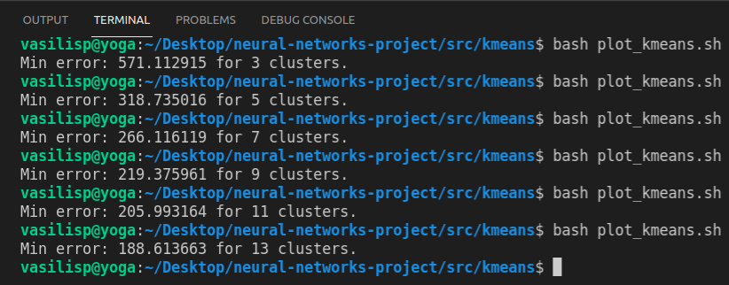

# Neural Network - K-means 

The purpose of this project is to implement and test a configurable MLP neural network and k-means algorithm.

## Data Generation 

For the creation of the datasets, the generate_dataset.c file has been created.
Executing it, creates the training_set.txt and test_set.txt for the training and
testing of the neural network and dataset2.txt for the k-means algorithm of the
second exercise. 

The datasets that where used for each task are generated by the script
`generate_dataset.c`. Executing it creates `training_set.txt` and 
`test_set.txt` for the training and testing of the neural network and 
`dataset2.txt` for the k-means algorithm.

### Example

```bash
$gcc generate_dataset.c utility.c -lm
$./a.out 
```

## Plotting

For the graphical representation of the data, the plot_dataset.py script 
is used. It accepts 1 or 2 files in the format `<x>, <y>, <label>`. In
case of importing one file, the script displays the dataset with group 
colors according to the `<label>`. The optional second argument assumes 
that the user inputs the k-means centroids in the format `<x>, <y>, 
<cluster_id>`, which are displayed as blue dots.

### Examples


```bash
$python plot_dataset.py ../../data/training_set.txt 
```


```bash
$python plot_dataset.py ../../out/labeled_data.txt ../../out/kmeans_clusters.txt  
```


## MLP Neural Network

For the execution and configuration of the network the file `runMlp.java` is used. 

* Setting the parameters of the network is done by changing the vatiables below: 

```java
int numOfHiddenLayers = 3; // type "2" or "3"
int D = 2;
int H1 = 10;
int H2 = 8;
int H3 = 8; // Ignored if numOfHiddenLayers == 2
int K = 4;
String hiddenLayerActivationFunction = "tanh"; //type "relu" or "tanh"
double LEARNING_RATE = 0.0009;
int BATCH_SIZE = 1;
int MINIMUM_EPOCHS = 700;
double TERMINATION_THRESHOLD = 0.1;
```

* For the exection run: 

```bash
$javac Neuron.java Mlp.java runMlp.java
$java runMlp 
```

Executing the java file initializes the network with its weigths, trains it and 
then uses the test data to calculate its accuracy. These three tasks are explained in depth below. 

+ `initWeights()`: initializes all weights and bias to random numbers from -1 to 1.
+ `gradientDescent()`: loads the training data for the network and runs the     
                        algorithm for the defined parameters. The functions 
                        `forwardPass(double[] networkInput)` and 
                        `backprop (double[] networkInput, double[] data_label)`
                        have been implemented for the algorithm to work. The 
                        `forwardPass()` function takes an input for the network as 
                        an argument and returns its output, while the `backprop()` 
                        function takes an input and the desired category that the 
                        network should return, calculates the error, and the partial 
                        derivative at each neuron. Depending on the number of 
                        mini-batches that are defined, the `updateWeights()` function 
                        is called, which updates the weights and biases in the network 
                        using the defined learning rate. Training runs for a minimum 
                        of 700 epochs (`MINIMUM_EPOCHS`), as defined, and continues until 
                        the difference between two consecutive errors is less than 
                        the threshold defined at the beginning of the program 
                        (`TERMINATION_THRESHOLD`). The total training error is 
                        printed at each epoch, and all results are written to the 
                        mlp_output.txt file upon termination. Finally, the time 
                        required to complete the training is printed. 
 
+ `testNetwork()`: loads the network's test data and then gives it as input, comparing 
                    its output with the desired output. At the end of the execution, it 
                    prints the percentage of correct decisions on the test set, and the 
                    results are written to the mlp_error.txt file.


### Output Function

The logistic function (sigmoid) is used for the output function of the network, as it is 
used for classifying data into categories.  

### Best Network Observed 

These are the parameters that where used to achieve the smallest generalization error: 

```java
int numOfHiddenLayers = 3; // type "2" or "3"
int D = 2;
int H1 = 10;
int H2 = 10;
int H3 = 8; // Ignored if numOfHiddenLayers == 2
int K = 4;
String hiddenLayerActivationFunction = "tanh"; //type "relu" or "tanh"
double LEARNING_RATE = 0.003;
int BATCH_SIZE = 1;
int MINIMUM_EPOCHS = 700;
double TERMINATION_THRESHOLD = 0.01;
```

+ The output: 


+ The curve of the error for each epoch: 


The output files of this execution are saved in the `out` directory as `mlp_error_final.txt` 
and `mlp_output_final.txt`.

### Results - Observations

<ins>Changing the number of neurons in the hidden layers</ins>

By changing the number of neurons in a network with two hidden layers, it was observed that
increasing the number of neurons in the first layer has a greater impact on generalization 
ability compared to increasing the number of neurons in the second hidden layer. Similarly, 
in a network with three hidden layers, smaller changes are observed when changing the number 
of neurons from the first to the third hidden layer. It should also be noted that adding the 
third hidden layer did not result in significant benefits as it increased training time 
without a significant increase in generalization ability.

<ins>Activation Function</ins>

Using the two activation functions, it was observed that using **relu** reduces the training 
time of the network but also reduces its generalization ability. Additionally, there were 
cases where many neurons stay inactive, meaning that they have continuous output of zero, 
which hinders the training of the network. Using the **hyperbolic tangent** function 
increases the training time significantly but achieves higher generalization ability and 
avoids the problem that was mentioned above.

<ins>Mini-Batch Size</ins>

Increasing the size of the mini-batch contributes to reducing the training time of the network, 
however, it reduces the generalization ability of the network as well.

## K-means

To execute k-means and display the results (plot), the `plot_kmeans.sh` bash script is used as follows:

```bash
$bash plot_kmeans.sh
```

The script will compile the necessary files to produce the executable, run k-means 20 times with randomly 
selected initial centroids, keep the solution with the smallest clustering error, and then call 
plot_dataset.py to display the result. The output files with the smallest clustering error are saved
in the `SEL_*.txt` files.

The above execution uses the `NUM_OF_CLUSTERS` variable, which defines the desired number of centroids, 
and is defined with a define statement in the `kmeans.h` file and can be changed to any number.

For M =  3, 5, 7, 9, 11, 13 we get the following results

|                                          |                                          |
|:----------------------------------------:|:----------------------------------------:|
|   M = 3   |   M = 5   |
|   M = 7   |   M = 9   |
|  M = 11 |  M = 13 |

The best error per case is printed on the terminal. The values are then used to plot 
the change in clustering error with the number of clusters.




### Result - Knee Method

In the graph it can be observed that although initially the error variation is large, it gradually decreases.
After 9 centers, the error variation is so small that, combined with the increased cost, it does not justify 
the choice of more centers as they will not represent the data much better.