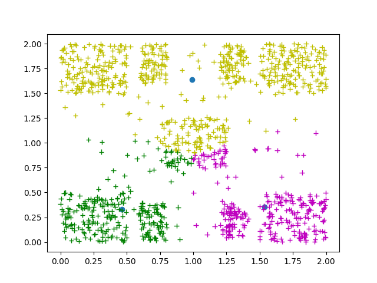

# Neural Network - K-means 

The purpose of this project is to implement and test a configurable MLP neural network and k-means algorithm.

## Data Generation 

For the creation of the datasets, the generate_dataset.c file has been created.
Executing it, creates the training_set.txt and test_set.txt for the training and
testing of the neural network and dataset2.txt for the k-means algorithm of the
second exercise. 

The datasets that where used for each task are generated by the script
`generate_dataset.c`. Executing it creates `training_set.txt` and 
`test_set.txt` for the training and testing of the neural network and 
`dataset2.txt` for the k-means algorithm.

### Example

```bash
$gcc generate_dataset.c utility.c -lm
$./a.out 
```

## Plotting

For the graphical representation of the data, the plot_dataset.py script 
is used. It accepts 1 or 2 files in the format `<x>, <y>, <label>`. In
case of importing one file, the script displays the dataset with group 
colors according to the `<label>`. The optional second argument assumes 
that the user inputs the k-means centroids in the format `<x>, <y>, 
<cluster_id>`, which are displayed as blue dots.

### Examples


```bash
$python plot_dataset.py ../../data/training_set.txt 
```


```bash
$python plot_dataset.py ../../out/labeled_data.txt ../../out/kmeans_clusters.txt  
```



## MLP Neural Network

For the execution and configuration of the network the file `runMlp.java` is used. 

* Setting the parameters of the network is done by changing the vatiables below: 

```java
int numOfHiddenLayers = 3; // type "2" or "3"
int D = 2;
int H1 = 10;
int H2 = 8;
int H3 = 8; // Ignored if numOfHiddenLayers == 2
int K = 4;
String hiddenLayerActivationFunction = "tanh"; //type "relu" or "tanh"
double LEARNING_RATE = 0.0009;
int BATCH_SIZE = 1;
int MINIMUM_EPOCHS = 700;
double TERMINATION_THRESHOLD = 0.1;
```

* For the exection run: 

```bash
$javac Neuron.java Mlp.java runMlp.java
$java runMlp 
```

Executing the java file initializes the network with its weigths, trains it and 
then uses the test data to calculate its accuracy. These three tasks are explained in depth below. 

+ `initWeights()`: initializes all weights and bias to random numbers from -1 to 1.
+ `gradientDescent()`: loads the training data for the network and runs the     
                        algorithm for the defined parameters. The functions 
                        `forwardPass(double[] networkInput)` and 
                        `backprop (double[] networkInput, double[] data_label)`
                        have been implemented for the algorithm to work. The 
                        `forwardPass()` function takes an input for the network as 
                        an argument and returns its output, while the `backprop()` 
                        function takes an input and the desired category that the 
                        network should return, calculates the error, and the partial 
                        derivative at each neuron. Depending on the number of 
                        mini-batches that are defined, the `updateWeights()` function 
                        is called, which updates the weights and biases in the network 
                        using the defined learning rate. Training runs for a minimum 
                        of 700 epochs (`MINIMUM_EPOCHS`), as defined, and continues until 
                        the difference between two consecutive errors is less than 
                        the threshold defined at the beginning of the program 
                        (`TERMINATION_THRESHOLD`). The total training error is 
                        printed at each epoch, and all results are written to the 
                        mlp_output.txt file upon termination. Finally, the time 
                        required to complete the training is printed. 
 
+ `testNetwork()`: loads the network's test data and then gives it as input, comparing 
                    its output with the desired output. At the end of the execution, it 
                    prints the percentage of correct decisions on the test set, and the 
                    results are written to the mlp_error.txt file.


