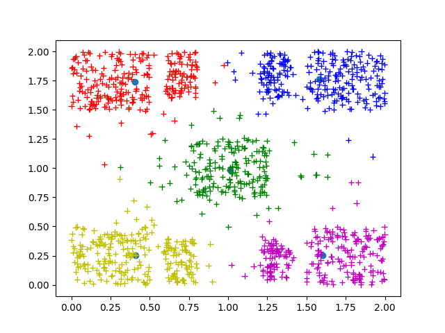
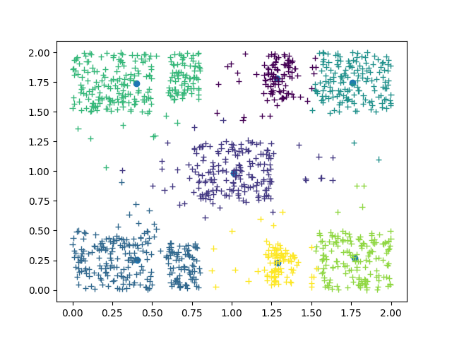

# **Άσκηση 2**

## Παράμετροι και Οδηγίες εκτέλεσης

Για να εκτελεστεί ο kmeans και να εμφανιστούν τα
αποτελέσματα (plot) χρησιμοποιείται το bash script
`plot_kmeans.sh`
ως:

```bash
$bash plot_kmeans.s
```

To script θα κάνει compile τα απαραίτητα αρχεία για
την παραγωγή του εκτελέσιμου, θα εκτελέσει τον kmeans 20 φορές με τυχαία
επιλεγμένα αρχικά κέντρα, θα κρατήσει την λύση με το μικρότερο σφάλμα
ομαδοποίησης και στην συνέχεια θα καλέσει το `plot_dataset.py` για να
εμφανίσει το αποτέλεσμα. Τα αρχεία εξόδου με το μικρότερο σφάλμα ομαδοποίησης
αποθηκεύονται στα αρχεία `*_final.txt`.

διαφορετικά απο τον φάκελο `kmeans` πρέπει να εκτελεστεί κάθε εντολή ξεχωριστά ως:

```bash
$gcc run_kmeans.c kmeans.c utility.c -lm
$./a.out
$python ../datasets/plot_dataset.py ../kmeans/labeled_data_final.txt ../kmeans/kmeans_clusters_final.txt
```

Η παραπάνω εκτέλεση χρησιμοποιεί τη μεταβλητή `NUM_OF_CLUSTERS`, που
ορίζει το επιθυμητο αριθμό κέντρων, η οποία έχει οριστεί με define στο
αρχείο `kmeans.h` και μπορεί να αλλαχθεί σε οποιονδήποτε αριθμό. Επίσης
στο αρχείο `run_kmeans.c` μπορεί να ορισθεί ο μέγιστος αριθμός
επαναλήψεων του αλγορίθμου απο την παράμετρο `max_iter` της συνάρτησης
kmeans.

Κατα την εκτέλεση του προγράμματος καλούνται οι παρακάτω συναρτήσεις.

+ `intialize_clusters`: Τυχαία αρχικοποίηση των κέντρων του kmeans
  χρησιμοποιώντας στο σύνολο δεδομένων.
+ `set_labels`: Ορισμός των ετικετών ομάδας των δεδομένων.
+ `reposition_cluster_centers`: Αλλαγή θέσης των κέντρων υπολογίζοντας τον μέσο
  όρο των συντεταγμένων των σημείων της ομάδας.
+ `clusters_converged`: Συνθήκη τερματισμου, επιστρέφει 1 αν τα κέντρα δεν έχουν
  αλλαξει θέση απο την προηγούμενη επανάληψη.
+ `intra_cluster_variance`: Υπολογισμός συνολικής διασποράς των ομάδων.

Για τον υπολογισμό του μέσου όρου χρησιμοποιείται ο πίνακας `cluster_sum_info`
ο οποίος περιέχει για κάθε ομάδα τα αθροίσματα των x και y συντεταγμένων των
σημείων στην πρώτη και δεύτερη θέση αντίστοιχα και το πλήθος των στοιχείων στην
τριτη.

</br>
</br>
</br>

## Αποτελέσματα

Με τον παραπάνω τρόπο εκτελέστηκε ο kmeans για Μ = 3, 5, 7, 9, 11, 13 κέντρα
επιστρέφοντας τα παρακάτω αποτελέσματα.

|                                          |                                          |
| :--------------------------------------: | :--------------------------------------: |
|   M = 3   |   M = 5   |
|   M = 7   |   M = 9   |
|  M = 11 |  M = 13 |

Το καλύτερο σφάλμα ανα περίπτωση τυπώνεται στο τερματικό.


Οι τιμές
χρησιμοποιούνται για τον σχεδιασμό του γραφήματος που δείχνει την μεταβολή
του σφάλματος ομαδοποίησης με τον αριθμό ομάδων.


Στο γράφημα μπορεί να παρατηρηθεί ότι ενώ αρχικά η μεταβολή του σφάλματος είναι
μεγάλη, σταδιακά μικραίνει. Μετά τα 9 κεντρα η μεταβολή του σφάλματος είναι
πλέον τόσο μικρή, που σε συνδυασμό με το αυξημένο κόστος, δεν
δικαιολογεί την επιλογή περισσότερων κέντρων καθώς δεν θα αντιπροσωπεύουν
με πολυ καλύτερο τρόπο τα δεδομένα. Αυτη η ευρετική μέθοδος ονομάζεται elbow η
knee method. Είναι γνωστή στην ανάλυση συστάδων (clustering analysis) και βοηθάει
στον εμπειρικό προσδιορισμό του πραγματικό αριθμού ομάδων σε ένα σύνολο
δεδομένων. Άρα πράγματι μπορούμε να προσδιορίσουμε τον πραγματικό αριθμό ομάδων
απο το σφάλμα ομαδοποίησης.
