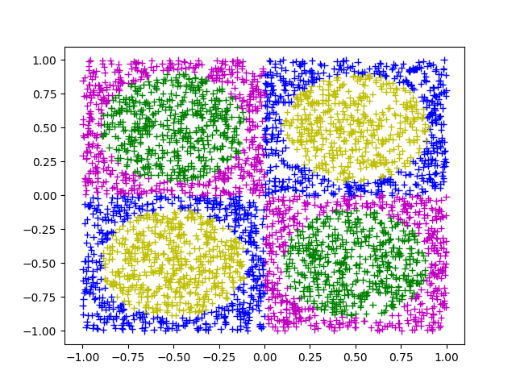
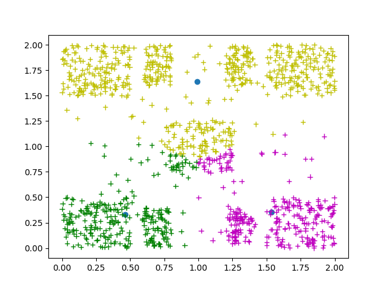

# **Εργαστηριακές Ασκήσεις στην Υπολογιστική Νοημοσύνη ακ. έτους 2021-2022**

Πούλος Βασίλης, 2805\
Δημητρόπουλος Δημήτρης, 4352\
Πούλος Γρηγόρης, 4480

## **Δημιουργία Συνόλων Δεδομένων**

Για την δημιουργία των συνόλων δεδομένων έχει δημιουργηθεί το αρχείο
`generate_dataset.c`. Mε την εκτέλεση του δημιουργεί τα `training_set.txt`
και `test_set.txt` για την εκπαίδευση και τον έλεγχο του νευρωνικoύ δικτύου της
πρώτης άσκησης και το `dataset2.txt` για τον αλγόριθμο kmeans της δεύτερης άσκησης.
Να σημειωθεί πως τα σύνολα δεδομένων αποθηκεύονται στον αντίστοιχο φάκελο της κάθε
άσκησης.

Παράδειγμα εκτέλεσης:

```bash
$gcc generate_dataset.c utility.c -lm
$./a.out 
```

## **Plotting**

Για την γραφική αναπαράσταση των δεδομένων χρησιμοποιείται το `plot_dataset.py`
το οποίο δέχεται 1 ή 2 αρχεία της μορφής `<x>, <y>, <label>`. Στην περίπτωση που
εισάγουμε ένα αρχείο το script εμφανίζει το σύνολο δεδομένων με χρώματα ομάδων
ανάλογα του `<label>`. Το προαιρετικό δεύτερο όρισμα υποθέτει οτι ο χρήσης
δίνει ως είσοδο κέντρα του kmeans στην μορφή `<x>, <y>, <cluster_id>` τα
οποία εμφανίζονται κάτω απο τα προηγούμενα δεδομένα με την μορφή ενός κύκλου.

Παραδείγματα εκτέλεσης:

```bash
$python plot_dataset.py ../mlp/training_set.txt 
```



```bash
$python plot_dataset.py ../kmeans/labeled_data.txt ../kmeans/kmeans_clusters.txt  
```



## **Σχόλια Υλοποίησης**

Η αρχική υλοποίηση της εργαστηριακής άσκησης ήταν εξ'ολοκλήρου σε C. Λόγω
κάποιου προβλήματος στον σχεδιασμό του MLP στην πρώτη άσκηση η τελική υλοποίηση
του παραδίδεται σε Java. Η αποσφαλμάτωση του κώδικα σε C κόστιζε περισσότερο
χρόνο απο ότι μπορούσαμε να διαθέσουμε επομένως η υπάρχουσα λογική μεταφράστηκε
σε Java.

Η λειτουργία των προγραμμάτων εξαρτάται απο την δομή των φακέλων που έχει
παραδοθεί.
Τα περιεχόμενα καθε φακέλου στο παραδοτέο εξηγούνται παρακατω:


+ `datasets`: το αρχείο `plot_dataset.py` που αναφέρθηκε παραπάνω.
+ `mlp`: η υλοποίηση του mlp σε Java.
+ `kmeans`: η υλοποίηση του kmeans σε C. Σε αυτό τον φάκελο περιέχεται και
το πρόγραμμα `generate_dataset.c` όπως αναφέρθηκε παραπάνω καθώς εξαρτάται απο
το αρχείο `utility.c` στο οποίο είναι συγκεντρωμένες διάφορες βοηθητικές
συναρτήσεις.